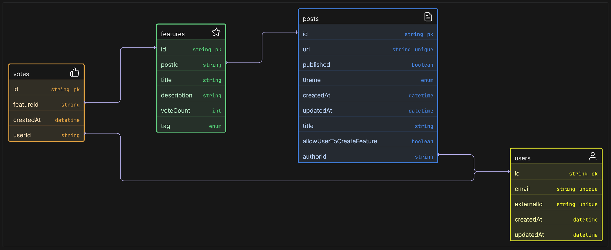

# Shipright - User Feedback & Feature Voting Platform

Shipright helps product teams collect, prioritize, and track user feedback efficiently. Transform user insights into impactful product decisions with our intuitive feature voting platform.

## Features

- 🎯 **Feature Voting System**
  - Let users vote on feature requests
  - Track popularity and demand
  - Automatic prioritization based on votes

- 📊 **Data-Driven Decisions**
  - Real-time insights dashboard
  - User engagement metrics
  - Feature request analytics

- 🎨 **Customizable Themes**
  - 6 beautiful themes available
  - Match your brand identity
  - Dark mode support

- 🔄 **Seamless Integration**
  - Easy setup process
  - Authentication ready
  - Responsive design

## Tech Stack

- Next.js
- React
- TypeScript
- Tailwind CSS
- Clerk Authentication
- Prisma
- Mongodb

## Flow Diagram

